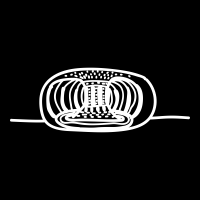
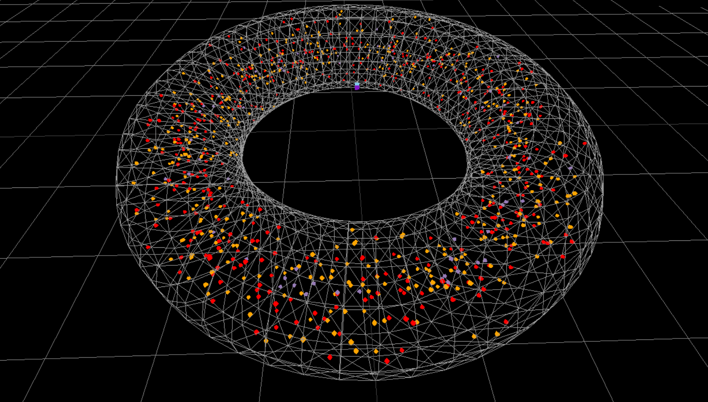

<!-- Improved compatibility of back to top link: See: https://github.com/othneildrew/Best-README-Template/pull/73 -->
<a name="readme-top"></a>

<!-- PROJECT SHIELDS -->
<!--
*** I'm using markdown "reference style" links for readability.
*** Reference links are enclosed in brackets [ ] instead of parentheses ( ).
*** See the bottom of this document for the declaration of the reference variables
*** for contributors-url, forks-url, etc. This is an optional, concise syntax you may use.
*** https://www.markdownguide.org/basic-syntax/#reference-style-links
-->
[![Contributors][contributors-shield]][contributors-url]
[![Stargazers][stars-shield]][stars-url]
[![MIT License][license-shield]][license-url] 
[![LinkedIn][linkedin-shield]][linkedin-url]


<!-- PROJECT LOGO -->
<br />
<div align="center">
  <a href="https://github.com/othneildrew/Best-README-Template">
    
  </a>

  <h3 align="center">Tokamak Simplified Simulator</h3>

  <p align="center">
    Tokamak simplified simulator that make the concept easy to visualise
    <br />
    <a href="https://github.com/Mach3tryhard/Tokamak-Simulator"><strong>Explore the docs »</strong></a>
    <br />
    <br />
    <a href="ramami.go.ro/tokamak">View Demo</a>
    ·
    <a href="mailto: matei.sirghe@gmail.com">Report Bug</a>
    ·
    <a href="mailto: matei.sirghe@gmail.com">Request Feature</a>
  </p>
</div>


<!-- TABLE OF CONTENTS -->
<details>
  <summary>Table of Contents</summary>
  <ol>
    <li>
      <a href="#about-the-project">About The Project</a>
      <ul>
        <li><a href="#built-with">Built With</a></li>
      </ul>
    </li>
    <li>
      <a href="#getting-started">Getting Started</a>
      <ul>
        <li><a href="#prerequisites">Prerequisites</a></li>
        <li><a href="#installation">Installation</a></li>
      </ul>
    </li>
    <li><a href="#Explanation">Usage</a></li>
    <li><a href="#roadmap">Roadmap</a></li>
    <li><a href="#license">License</a></li>
    <li><a href="#contact">Contact</a></li>
    <li><a href="#acknowledgments">Acknowledgments</a></li>
  </ol>
</details>


<!-- ABOUT THE PROJECT -->
## About The Project




Tokamak simplified simulator that make the concept easy to visualise. Physics is easier to understand when you simplify and can simulate on pc what happens in the real world.

Here's why:
* Nice animation that you want to watch for hours
* Kinda accurate physics wise

<p align="right">(<a href="#readme-top">back to top</a>)</p>


### Built With

This section should list any major frameworks/libraries used to bootstrap your project. Leave any add-ons/plugins for the acknowledgements section. Here are a few examples.

* [![Three][Three.js]][Three-url]
* [![Cannon][Cannon.js]][Cannon-url]
* [![Cannond][Cannond.js]][Cannond-url]
* [![datgui][datgui.io]][datgui-url]
* [![stats][stats.dev]][stats-url]

<p align="right">(<a href="#readme-top">back to top</a>)</p>


<!-- GETTING STARTED -->
## Getting Started

How to get a local copy up and running follow these simple example steps.

### Prerequisites

Node installation is required to run this project.
* npm
  ```sh
  npm install npm@latest -g
  ```

### Installation

1. Clone the repo
   ```sh
   git clone https://github.com/Mach3tryhard/Tokamak-Simulator.git
   ```
2. Install NPM packages
   ```sh
   npm install --save three
   npm install --save-dev vite
   npm install cannon-es
   npm install cannon-es-debugger
   npm install --save dat.gui
   ```
3. Run using
  ```sh
  npx vite
  ```

<p align="right">(<a href="#readme-top">back to top</a>)</p>

<!-- ROADMAP -->
## Roadmap

- [x] Add Controls
- [x] Add Physics
- [ ] Add better Physics
- [ ] Add additional controls
- [ ] Multi-language Support
    - [x] English
    - [ ] Romanian
    - [ ] French 😫

<p align="right">(<a href="#readme-top">back to top</a>)</p>

<!-- LICENSE -->
## License

Distributed under the Apache License. See `LICENSE.txt` for more information.

<p align="right">(<a href="#readme-top">back to top</a>)</p>


<!-- CONTACT -->
## Contact

Matei Sirghe - matei.sirghe@gmail.com

Project Link: [https://github.com/Mach3tryhard/Tokamak-Simulator](https://github.com/Mach3tryhard/Tokamak-Simulator)

<p align="right">(<a href="#readme-top">back to top</a>)</p>


<!-- ACKNOWLEDGMENTS -->
### Read me file made using
* [Choose an Open Source License](https://choosealicense.com)
* [Img Shields](https://shields.io)
* [Github Template](https://github.com/othneildrew/Best-README-Template)

<p align="right">(<a href="#readme-top">back to top</a>)</p>


<!-- MARKDOWN LINKS & IMAGES -->
<!-- https://www.markdownguide.org/basic-syntax/#reference-style-links -->
[contributors-shield]: https://img.shields.io/badge/1-Contributor-blue?logoColor=ffffff
[contributors-url]: https://github.com/Mach3tryhard/Tokamak-Simulator/graphs/contributors
[stars-shield]:  https://img.shields.io/badge/1-Stars-yellow?logoColor=ffffff
[stars-url]: https://github.com/Mach3tryhard/Tokamak-Simulator/stargazers
[license-shield]: https://img.shields.io/badge/Apache-License-FFA500
[license-url]: https://github.com/Mach3tryhard/Tokamak-Simulator/LICENSE.txt
[linkedin-shield]: https://img.shields.io/badge/Linkedin-ffffff?logo=linkedin&logoColor=ffffff&labelColor=%230A66C2
[linkedin-url]: https://linkedin.com
[product-screenshot]: images/screenshot.png
[Three.js]: https://img.shields.io/badge/Three.js-20232A?style=for-the-badge&logo=threedotjs
[Three-url]: https://threejs.org/
[Cannon.js]: https://img.shields.io/badge/Cannon-es%3F000000?logo=c&logoColor=000000
[Cannon-url]: https://pmndrs.github.io/cannon-es/
[Cannond.js]: https://img.shields.io/badge/Cannonesdebugger-000000?logo=c&logoColor=000000&color=ffffff
[Cannond-url]: https://pmndrs.github.io/cannon-es/
[datgui.io]: https://img.shields.io/badge/Dat.gui.js-123123?logoColor=000000&color=123412
[datgui-url]: https://angular.io/
[stats.dev]: https://img.shields.io/badge/Stats.js-123123?logoColor=000000&color=f21f4f
[stats-url]: https://www.npmjs.com/package/stats-js
